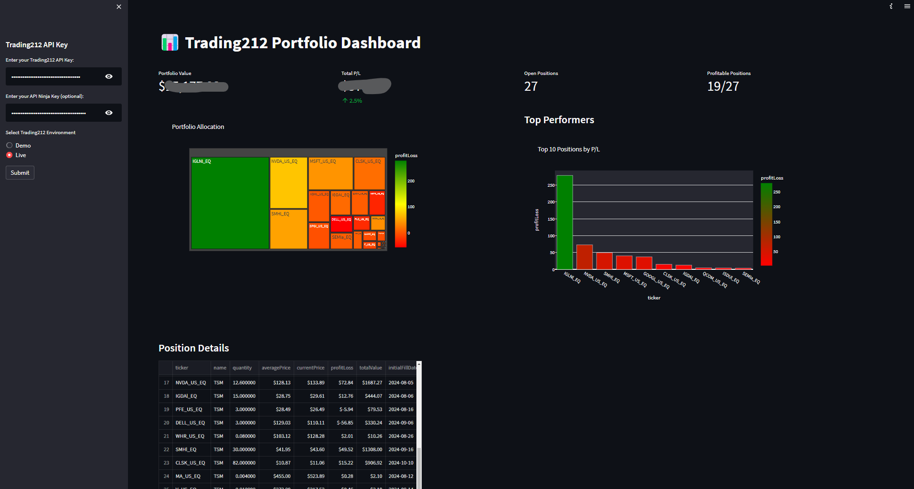

# Trading212 Portfolio Dashboard

📊 **Trading212 Portfolio Dashboard** is a web application that provides a comprehensive view of your Trading212 portfolio using their API. This dashboard allows users to visualize their portfolio allocation, track performance, and analyze open positions.

## Features

- **Portfolio Overview**: Visualize your portfolio allocation using interactive charts.
- **Top Performers**: Identify the top-performing stocks in your portfolio.
- **Position Details**: View detailed information about each stock in your portfolio.
- **Environment Selection**: Choose between Demo and Live Trading212 environments.
- **API Integration**: Fetch real-time stock prices and portfolio data from Trading212 and API Ninja.



## Requirements

- Python 3.7 or higher
- Streamlit
- Pandas
- Plotly
- Requests

## Installation

```
#1. Clone the repository:
git clone https://github.com/gyzi/trading-dashboard.git
cd trading-dashboard

#2. Create a virtual environment (optional but recommended):
python -m venv venv
source venv/bin/activate # On Windows use venv\Scripts\activate.ps1

#3. Install the required packages:
pip install -r requirements.txt
```

## Usage

1. Run the Streamlit application:
```
streamlit run dashboard.py  # Or on windows .\venv\Scripts\streamlit.cmd run .\dashboard.py
```
2. Open your web browser and go to `http://localhost:8501`.

3. Enter your Trading212 API key and (optionally) your API Ninja key in the sidebar.

4. Select the environment (Demo or Live) and click the "Submit" button to load your portfolio data.

5. Explore the dashboard to view your portfolio allocation, top performers, and position details.

## Getting API Keys

- **Trading212 API Key**: You can obtain your Trading212 API key by navigating to [Trading212 Settings > API](https://app.trading212.com/settings/api).

- **API Ninja Key**: Sign up at [API Ninjas](https://api-ninjas.com/api) to get your API key for fetching real-time stock prices.

## CI/CD Integration with Azure

I am planning to implement a CI/CD pipeline using GitHub Actions to deploy this application on Azure App Service. This will allow for automated testing and deployment whenever changes are made to the codebase. 

### GitHub Workflow

The workflow will be configured to build and deploy a Docker container of the application to Azure App Service. For more information on setting up GitHub Actions for Azure, refer to [Azure App Service Deployment Documentation](https://learn.microsoft.com/en-us/azure/app-service/deploy-github-actions).

## Contributing

Contributions are welcome! If you have suggestions or improvements, please feel free to open an issue or submit a pull request.

## Support

If you find this project helpful, consider supporting the developer by watching the demo video on YouTube: [Watch Demo](https://www.youtube.com/watch?v=s2IHQ0XWzBo).
